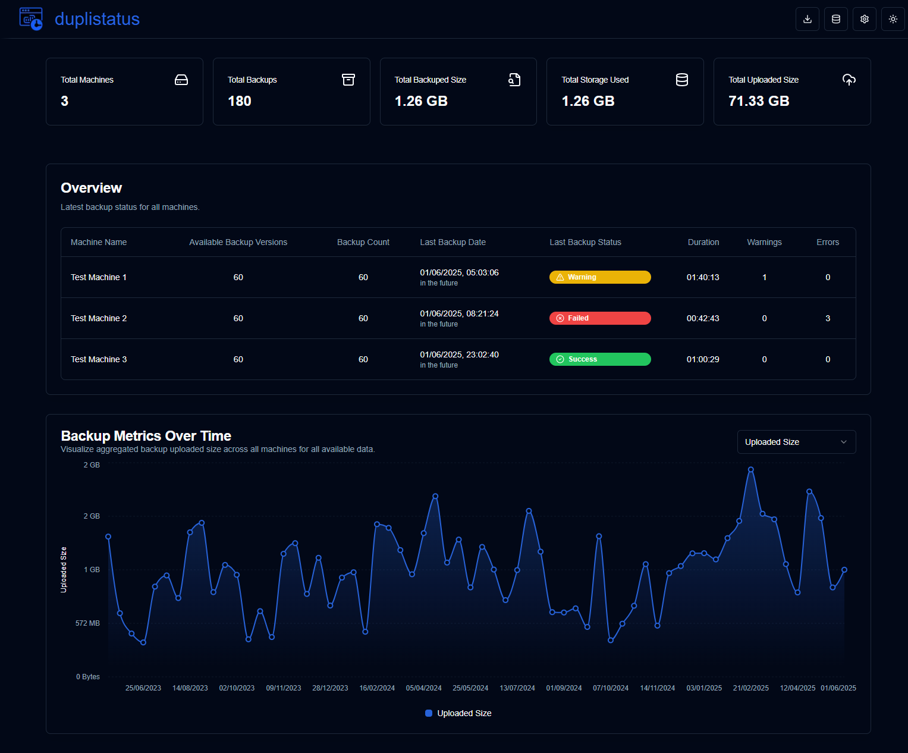
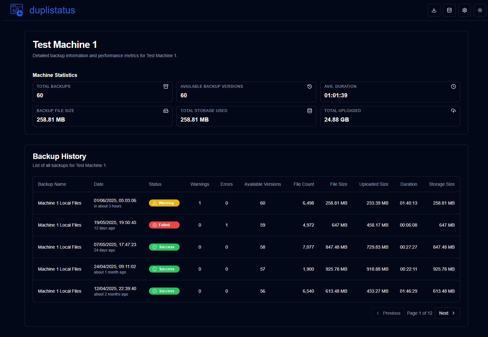
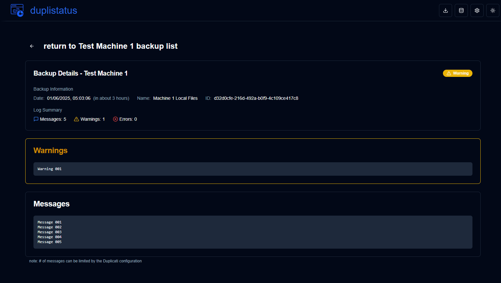
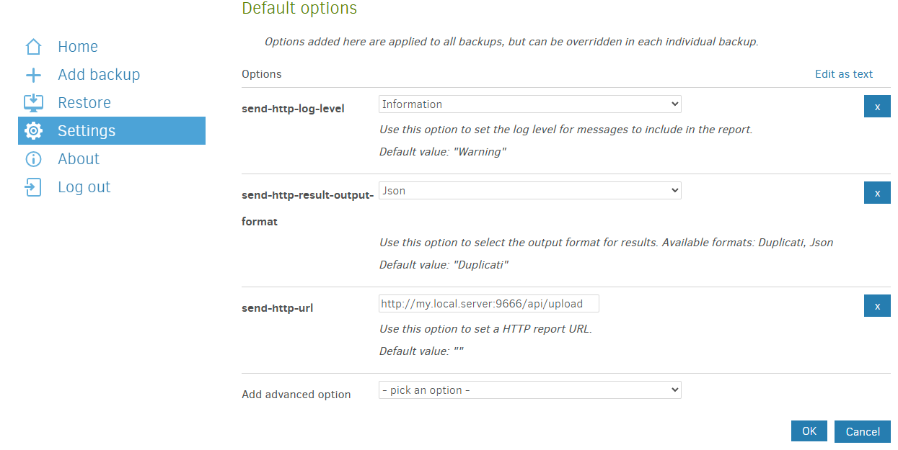
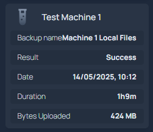

# **duplistatus** - Another [Duplicati](https://github.com/duplicati/duplicati) Dashboard

This web application is used to monitor and visualise backup operations from [Duplicati](https://github.com/duplicati/duplicati). **duplistatus** provides a comprehensive dashboard to track backup statuses, metrics and performance across multiple machines. It also provides an API endpoint that can be integrated with third-party tools such as the [Homepage](https://gethomepage.dev/).

## Features 

- **Overview**: Real-time display of backup status for all machines
- **Machine details**: Detailed view of backup history for each machine
- **Data visualisation**: Interactive charts showing backup metrics over time
- **Collect logs**: Collect backup logs directly from the Duplicati servers.
- **Dark/light Theme**: Toggle between dark and light themes for comfortable viewing
- **API access**: API endpoints to expose backup status to [Homepage](https://gethomepage.dev/) or any other tool that suports RESTful APIs.
- **Easy to install**: Run inside a container (images in Docker Hub and GitHub Container Registry)

<br><br>

## Screenshots

### Dashboard


### Machine detail


### Backup detail


<br><br>

## Installation

The application can be deployed using Docker or 
[Portainer Stacks](https://docs.portainer.io/user/docker/stacks). 


### Container images:

You can use the images from:
 - **Docker Hub**:  `wsjbr/duplistatus:latest`
 - **GitHub Container Registry**: `ghcr.io/wsj-br/duplistatus:latest`

<br>

### Option 1: Using Docker Compose

This is the recommended method for local deployments or when you want to customize the configuration. It uses a `docker compose` file to define and run the container with all its settings.

Create a file named `duplistatus.yml` with the following content:

```yaml
services:
  duplistatus:
    image: wsjbr/duplistatus:latest
    container_name: duplistatus
    restart: unless-stopped
    ports:
      - "9666:9666"
    volumes:
      - duplistatus_data:/app/data
    environment:
      - NODE_ENV=production
      - PORT=9666
      - NEXT_TELEMETRY_DISABLED=1
    healthcheck:
      test: ["CMD", "curl", "-f", "-s", "http://localhost:9666/api/health"]
      interval: 30s
      timeout: 10s
      retries: 3
      start_period: 40s

volumes:
  duplistatus_data:
    name: duplistatus_data 
```

After creating the file, run:
```console
# docker-compose -f duplistatus.yml up -d
```

The application will then be available at `http://localhost:9666`

<br>

### Option 2: Using Portainer Stacks (Docker Compose)

1. Go to "Stacks" in your [Portainer](https://docs.portainer.io/user/docker/stacks) server and click "Add stack"
2. Name your stack (e.g., "duplistatus")
3. Choose "Build method" as "Web editor"
4. Copy and paste the Docker Compose configuration from Option 1 into the web editor
5. Click "Deploy the stack"

<br>

### Option 3: Using Portainer Stacks (GitHub Repository)

1. In [Portainer](https://docs.portainer.io/user/docker/stacks), go to "Stacks" and click "Add stack"
2. Name your stack (e.g., "duplistatus")
3. Choose "Build method" as "Repository"
4. Enter the repository URL: <br>
`https://github.com/wsj-br/duplistatus.git`

5. In the "Compose path" field, enter: `docker-compose.yml`
6. Click "Deploy the stack"

<br>

### Option 4: Using Docker CLI

```shell
docker volume create duplistatus_data

docker run -d \
  --name duplistatus \
  -p 9666:9666 \
  -v duplistatus_data:/app/data \
  -e NODE_ENV=production \
  -e PORT=9666 \
  -e NEXT_TELEMETRY_DISABLED=1 \
  wsjbr/duplistatus:latest
```

- The application will be available at `http://localhost:9666`.
- The `duplistatus_data` volume will be used for persistent storage.


<br><br>

# Duplicati Configuration


1. **Allow remote access:**  login into the [Duplicati's UI](https://docs.duplicati.com/getting-started/set-up-a-backup-in-the-ui), select `Settings` and allow remote access, including a list of hostnames (or use `*`). 


> [!WARNING]
>  Only enable remote access if your Duplicati server is protected by a secure network (e.g., VPN, private LAN, or firewall rules). Exposing the Duplicati interface to the public internet without proper security measures could lead to unauthorised access.


2. **Configure to send the backup results to duplidash:** in the Duplicati configuration page, select `Settings` and in the `Default Options` section, include these options:

```bash
--send-http-url=http://my.local.server:9666/upload
--send-http-result-output-format=Json
--send-http-log-level=Information
```
> [!NOTE]
>    Alternatively you can include this configuration in the `Advanced Options` of each backup. 
>    If you ommit `--send-http-log-level` no message will be sent to **dupistatus**, just the statistics.
>    you can use `--send-http-max-log-lines` to limite the number of messages sent. 
>    For example, limit in 20 messages: `--send-http-max-log-lines=20`

<br>

> [!TIP]
>  click on `Edit as text` and copy the two lines above, adjusting the server name/IP.

<br>



<br>


# Homepage integration (optional)

To integrate **duplistatus** with [Homepage](https://gethomepage.dev/), you can add a widget to your `services.yaml` configuration file using the [Custom API widget](https://gethomepage.dev/widgets/services/customapi/) to fetch backup status information from **duplistatus**.

## Summary 

Show the overall summary of the backup data stored in the duplistatus's database. Below is an example showing how to configure this integration.

```yaml
    - Dashboard:
        icon: mdi-cloud-upload
        href: http://my.local.server:9666/
        widget:
          type: customapi
          url: http://my.local.server:9666/api/summary
          display: list
          refreshInterval: 60000
          mappings:
            - field: totalMachines
              label: Machines
            - field: totalBackups
              label: Backups received
            - field: secondsSinceLastBackup
              label: Last backup
              format: duration
            - field: totalBackupedSize
              label: Backuped size
              format: number
              scale: 0.000000001
              suffix: GB     
            - field: totalStorageUsed
              label: Storage used
              format: number
              scale: 0.000000001
              suffix: GB     
            - field: totalUploadedSize
              label: Uploaded size
              format: number
              scale: 0.000000001
              suffix: GB     
```

Will show:

<div style="padding-left: 60px;">

  

</div>

## Last backup information

Show the latest backup information for a given machine or server. The example below shows how to configure this integration.

```yaml
   - Test Machine 1:
        icon: mdi-test-tube
        widget:
          type: customapi
          url: http://my.local.server:9666/api/lastbackup/Test%20Machine%201
          display: list
          refreshInterval: 60000
          mappings:
            - field: latest_backup.name
              label: Backup name
            - field: latest_backup.status
              label: Result
            - field: latest_backup.date
              label: Date
              format: date
              locale: en-GB 
              dateStyle: short
              timeStyle: short
            - field: latest_backup.duration
              label: Duration
              format: duration
            - field: latest_backup.uploadedSize
              label: Bytes Uploaded
              format: number
              scale: 0.000001
              suffix: MB        
```

Will show:

<div style="padding-left: 60px;">

  

</div>

> [!TIP] 
> For a complete list of available fields, see the [Get Latest Backup](#get-latest-backup) section.

<br><br>


# API Endpoints

The following endpoints are available:

- [Upload Backup Data](#upload-backup-data)
- [Get Latest Backup](#get-latest-backup)
- [Get Overall Summary](#get-overall-summary)


<br>

## Upload Backup Data
- **Endpoint**: `/api/upload`
- **Method**: POST
- **Description**: Uploads backup operation data for a machine
- **Request Body**: Json sent by Duplicati with the following options:

  ```bash
  --send-http-url=http://my.local.server:9666/api/upload
  --send-http-result-output-format=Json
  --send-http-log-level=Information
  ```
  
- **Response**: 
  ```json
  {
    "success": true
  }
  ```

<br>

## Get Latest Backup
- **Endpoint**: `/api/lastbackup/:machineId`
- **Method**: GET
- **Description**: Retrieves the latest backup information for a specific machine
- **Parameters**:
  - `machineId`: the machine identifier (ID or name)

> [!NOTE]
> The machine identifier has to be URL Encoded.
  
- **Response**:
  ```json
  {
    "machine": {
      "id": "unique-machine-id",
      "name": "Machine Name",
      "created_at": "2024-03-20T10:00:00Z"
    },
    "latest_backup": {
      "id": "backup-id",
      "name": "Backup Name",
      "date": "2024-03-20T10:00:00Z",
      "status": "Success",
      "warnings": 0,
      "errors": 0,
      "fileCount": 249426,
      "fileSize": 113395849938,
      "uploadedSize": 331318892,
      "duration": "00:38:31",
      "duration_seconds": 2311.6018052,
      "durationInMinutes": 38.52669675333333,
      "knownFileSize": 27203688543,
      "backup_list_count": 10
    },
    "status": 200
  }
  ```

<br>

## Get Overall Summary
- **Endpoint**: `/api/summary`
- **Method**: GET
- **Description**: Retrieves a summary of all backup operations across all machines
- **Response**:
  ```json
  {
    "totalMachines": 3,
    "totalBackups": 9,
    "totalUploadedSize": 2397229507,
    "totalStorageUsed": 43346796938,
    "totalBackupedSize": 126089687807,
    "secondsSinceLastBackup": 264
  }
  ```
<br><br>

# Development

Detailed instructions on how to download the source code, make changes, debug and run in development mode (debug) can be found in the file [DEVELOPMENT.md](DEVELOPMENT.md)

This application was developed almost entirely using AI tools. The step-by-step process and tools used are described in [HOW-I-BUILD-WITH_AI.md](docs/HOW-I-BUILD-WITH-AI.md)

<br><br>

# Copyright Notice

**Copyright © 2025 Waldemar Scudeller Jr.**

```
SPDX-License-Identifier: Apache-2.0
```

## License Summary

This work is licensed under the Apache License, Version 2.0 (the "License").
You may not use this work except in compliance with the License.  
You may obtain a copy of the License at:

[http://www.apache.org/licenses/LICENSE-2.0](http://www.apache.org/licenses/LICENSE-2.0)

Unless required by applicable law or agreed to in writing, software  
distributed under the License is distributed on an **"AS IS" BASIS**,  
**WITHOUT WARRANTIES OR CONDITIONS OF ANY KIND**, either express or implied.  
See the License for the specific language governing permissions and  
limitations under the License.

