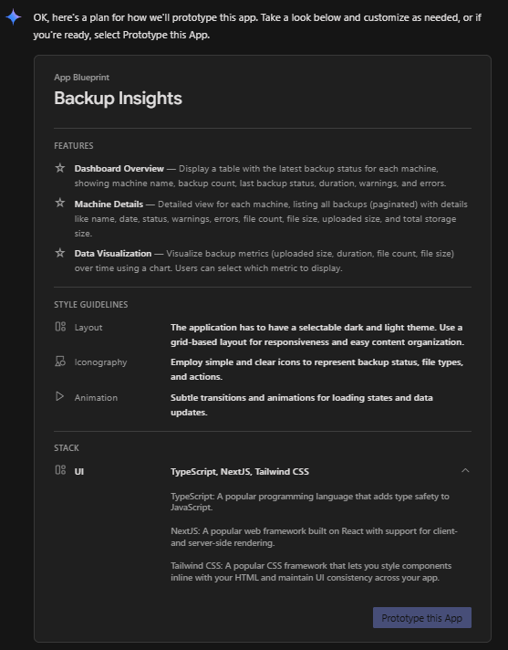
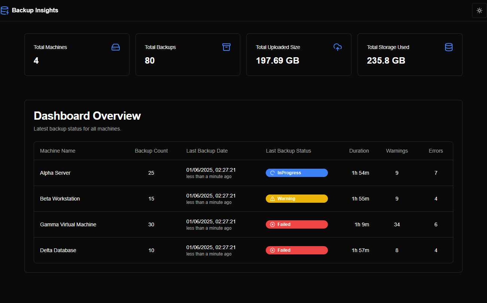
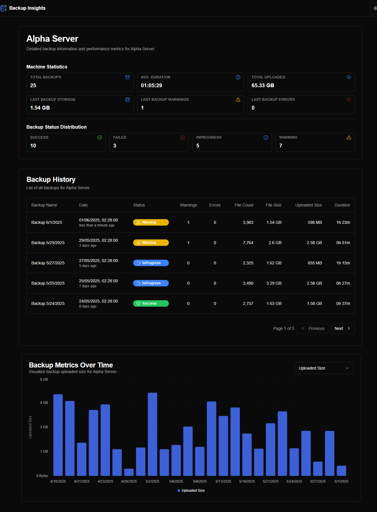

# Motivation

I started to use the duplicati as the backup tool for my home servers, tried the official [Duplicati dashboard](https://app.duplicati.com/) and [Duplicati Monitoring](https://www.duplicati-monitoring.com/), has two main requirements: (1) self-hosted; (2) expose an API to be integrated with Homepage (https://gethomepage.dev/), as I'm using it as my home lab's home page.

Also tried to connect directly to each Duplicati server on the network, but the authentication method of the Duplicati server was not compatible with Homepage. 

I was also trying some AI code tools, so I decided to give a try using AI to build this tools for me. Here is the process I used...

# Tools used

1. for the UI: [Google's Firebase Studio](https://firebase.studio/)
2. for the implementation: Cursor (https://www.cursor.com/)

# UI

Create a new project in Firebase Studio [https://studio.firebase.google.com/] and used this prompt in the "Prototype an app with AI"

> A web dashboard application using tailwind/react to consolidate in a sqllite3 database the backup result sent by the duplicati backup solution using the option --send-http-url (json format) of several machines, keep tracking of the status of the backup, size, upload sizes.
> 
> The dashboard first page should have a table with the last backup of each machine in the first page, including the machine name, number of backups stored in the database, the last backup status, duration (hh:mm:ss), number of warnings and errors.
> 
> When clicking a machine line, show a detail page of the select machine with a list of the stored backups (paginated), including the backup name, date and time of the backup, including how long it was ago, the status, number of warnings and errors, number of files, the size of the files, size uploaded and the total size of the storage. Also include in the detail page a chart using Tremor with the evolution of the fields: uploaded size; duration in minutes, number of files examined, size of the files examined. The chart should plot one field at time, with a dropbox to select the desired field to plot. Also the chart has to present all the backups stored in the database, not only the ones showing in the paginated table.
> 
> The application has to expose a api endpoint to receive the post from the duplicati server and other api endpoint to retrieve all the details of the last backup of a machine as a json.
> 
> The design should be modern, responsive and include icons and other visual aids to make it easy to read. The code has to be clean, concise and easy to maintain. Use modern tools like pnpm to deal with dependencies.
> 
> The application has to have a selectable dark and light theme.
> 
> The database should store these fields received by the duplicati json:
> 
> "{ "Data": { "DeletedFiles": 0, "DeletedFolders": 0, "ModifiedFiles": 0, "ExaminedFiles": 15399, "OpenedFiles": 1861, "AddedFiles": 1861, "SizeOfModifiedFiles": 0, "SizeOfAddedFiles": 13450481, "SizeOfExaminedFiles": 11086692615, "SizeOfOpenedFiles": 13450481, "NotProcessedFiles": 0, "AddedFolders": 419, "TooLargeFiles": 0, "FilesWithError": 0, "ModifiedFolders": 0, "ModifiedSymlinks": 0, "AddedSymlinks": 0, "DeletedSymlinks": 0, "PartialBackup": false, "Dryrun": false, "MainOperation": "Backup", "ParsedResult": "Success", "Interrupted": false, "Version": "2.1.0.5 (2.1.0.5_stable_2025-03-04)", "EndTime": "2025-04-21T23:46:38.3568274Z", "BeginTime": "2025-04-21T23:45:46.9712217Z", "Duration": "00:00:51.3856057", "WarningsActualLength": 0, "ErrorsActualLength": 0, "BackendStatistics": { "BytesUploaded": 8290314, "BytesDownloaded": 53550393, "KnownFileSize": 9920312634, "LastBackupDate": "2025-04-22T00:45:46+01:00", "BackupListCount": 6, "ReportedQuotaError": false, "ReportedQuotaWarning": false, "MainOperation": "Backup", "ParsedResult": "Success", "Interrupted": false, "Version": "2.1.0.5 (2.1.0.5_stable_2025-03-04)", "BeginTime": "2025-04-21T23:45:46.9712252Z", "Duration": "00:00:00", "WarningsActualLength": 0, "ErrorsActualLength": 0 } }, "Extra": { "OperationName": "Backup", "machine-id": "66f5ffc7ff474a73a3c9cba4ac7bfb65", "machine-name": "WSJ-SER5", "backup-name": "WSJ-SER5 Local files", "backup-id": "DB-2" } } "

this generated an App Blueprint, I modified the generate slightly before clicking in "Prototype this App", see below: 

and later these prompts to adjust the first version

> remove the button "view details" from the dashboard overview page and the link on the machine name, if the user click anywhere on the row, it will show the detail page.

> when presenting sizes in bytes, use a automatic scale (KB, MB, GB, TB).

> in the detail page, move the chart after the table. Change the color of the barchart to some other color compatible with light and dark themes.

> in the detail page, reduce the number of rows to present 5 backups per page.

> in the dashboard overview, put a summary on top with the number of machines in the database, total number of backups of all machines, the total uploaded size of all backups and total storage used by all machines. Include icons to facilitate the visualization.

> please persist the theme select by the user. also, add some lateral margins and make the UI use 90% of the available width.

> in the machine detail header card, include a sumary with the total of backups stored for this machine, a statistic of the backup status, the number of warnings and errors of the last backup, the average duration in hh:mm:ss, the total uploaded size of all backups and the storage size used based on the last backup information received.

> make the summary smaller and more compact to reduce the footprint used.

> when presenting the last backup date, show in the same cell, in small gray font the time ago the backup happen (for instance, x minute ago, x hours ago, x days ago, x weeks ago, x months ago, x years ago).

> in the dashboard overview put last backup date before last backup status

After iterating through these prompts, Firebase generated the final prototype as shown in the screenshots below:

After completing the initial prototype, I accessed the source code by clicking the `</>` button in the interface. I then used the Git extension to export the code and push it to a private repository on [GitHub](https://www.github.com).

  

# Backend

## Setup

Downloaded the code from github  (git clone) to a local folder (in my case, into a Raspberry Pi 5). 

Setup [Cursor](http://www.cursor.com) and accesing it from my windows machine using SSH connection

Copy a sample of the json sent by Duplicati into a file ([`database_values.json`](database_values.json)), keeping only some selected fields.

  

## Implementation

I used an initial prompt to start the implementation, persistence, fixes, and new features. It was a long but very interesting process.

### Using AI to generate the prompt

I created a detailed prompt using Cursor Chat (`Manual` mode, `Auto` model):

> improve this text as a prompt to cursor ai tool to generate the implementation of an applicaiton prototype:
> 
> please create a plan generate the full implementation of a Next.js application prototype from this codebase. Your implementation should thoroughly analyze the provided codebase to maintain the exact visual aesthetics, user experience, and navigation flow. For data storage, utilize SQLite3. Generate the database and populate it using the structure and content found in the @database_values.json file, ensuring every field from the JSON is fully integrated and persisted.

The AI generated the following prompt:

>Create a comprehensive implementation plan for a Next.js application prototype with the following requirements:
>
>1. Technical Stack:
>   - Next.js 14+ with App Router
>   - TypeScript for type safety
>   - SQLite3 for data persistence
>   - TailwindCSS for styling
>   - React Server Components where appropriate
>   - Client components for interactive elements
>
>2. Database Design:
>   - Analyze database_values.json to create an optimal SQLite schema
>   - Design tables to efficiently store all backup data
>   - Include indexes for common queries
>   - Implement data validation and type safety
>
>3. Application Structure:
>   - Implement the exact UI/UX from the provided codebase
>   - Create reusable components for common elements
>   - Set up proper routing using App Router
>   - Implement responsive layouts
>   - Add dark/light theme support
>
>4. Core Features:
>   - Dashboard overview with machine status table
>   - Detailed machine view with backup history
>   - Data visualization using charts
>   - Real-time backup status updates
>   - Proper error handling and loading states
>
>5. Data Management:
>   - Create API routes for data operations
>   - Implement efficient data fetching strategies
>   - Add proper data validation
>   - Include error handling for database operations
>
>Please provide a detailed implementation plan that covers all these aspects while maintaining the existing visual design and user experience.

Copied the generated prompt to the clipboard.

### The Journey Begins...

Created a new chat by clicking the `+` button, switched to `Agent` mode, and pasted the prompt using Ctrl+Shift+V (as text).

After the plan was generated, typed `please, implement this plan` in the chat to begin implementation.

> [!NOTE]
> I only included the starting point since I didn't record the prompts used. There were many of them.

  

# Notes:

- Some models can get stuck when fixing bugs. "claude-3.5" and "claude-4" are usually better, but sometimes you have to try another model (GPT, Gemini, etc.).
For complex bugs or errors, use a prompt to analyse possible causes of the error instead of simply asking to fix it.
- When making complex modifications, use a prompt to create a plan and then ask the AI agent to implement it. This always works better.
- Be specific when changing the source code. If possible, select the relevant part of the code in the editor and press Ctrl+L to include it in the chat as context.
- Also include a reference to the file you are mentioning in the chat to help the AI agent focus on the relevant part of the code and avoic making changes in other parts of the code.
- I have the tendency to anthropomorphise the AI agent given that it persistently uses 'we', 'our code' and 'would you like me to...'. This is also to improve my odds of survival in case (or [when](https://ai-2027.com/)) Skynet becomes sentient and the Terminator is invented.
- Sometimes, use [Gemini](https://gemini.google.com/app), [Deepseek](https://chat.deepseek.com/), [ChatGPT](https://chat.openai.com/), [Manus](https://manus.im/app),... to generate prompts with better instructions to the AI agent. 

